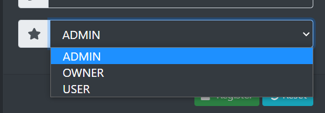
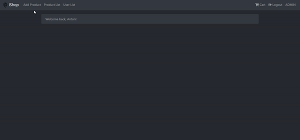
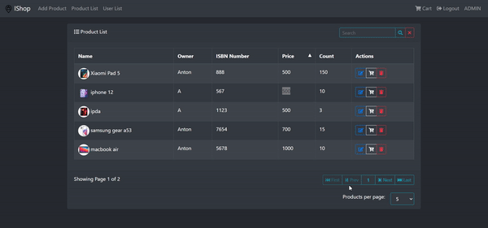
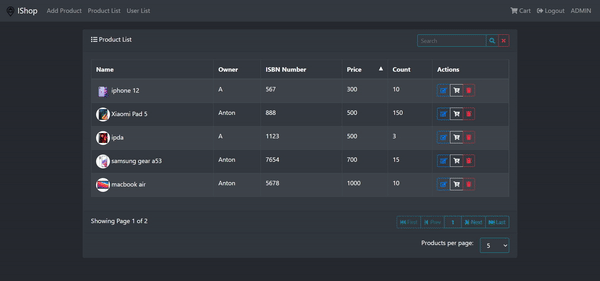

Easy backend service for internet shop.

Stack
Spring Boot, Spring WebMVC, JPA, FlywayDB or Liquibase, JUnit or Spock framework.

Модель данных
Сущности Product (товар), Order (заказ), Customer (клиент)
Клиент формирует заказ из товаров, задавая количество единиц товара.
Заказ может иметь статусы: новый, оплачен, доставлен, отменен.
REST-интерфейс (API)
CRUD операции для Product, Customer. Для Order только создание, чтение и изменение статуса.
Запросы и ответы сериализуются в JSON. Выполняется валидация запросов.
Запрещено удалять сущности, на которые есть ссылки. Например, нельзя удалить товар, который
участвует в заказах.

JavaDoc на английском, unit тесты по теории TDD.

Сборка и тестирование проекта через Gradle.

Register example

You can register like USER, OWNER or ADMIN  
USER can add product to cart  
OWNER USER's credentials and create/change/delete product  
ADMIN OWNER's credentials and delete/change users  

Login example:

Example product adding:

Example change pages and sort by price  
Like Admin you can delete or change product  

How to add a product to the cart and choose what you want to buy

