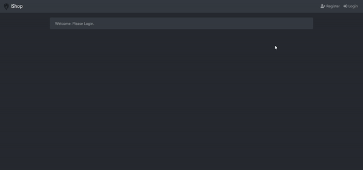
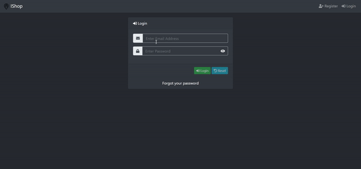

Easy backend service for internet shop.

Stack
Spring Boot, Spring WebMVC, JPA, FlywayDB or Liquibase, JUnit or Spock framework.

Модель данных
Сущности Product (товар), Order (заказ), Customer (клиент)
Клиент формирует заказ из товаров, задавая количество единиц товара.
Заказ может иметь статусы: новый, оплачен, доставлен, отменен.
REST-интерфейс (API)
CRUD операции для Product, Customer. Для Order только создание, чтение и изменение статуса.
Запросы и ответы сериализуются в JSON. Выполняется валидация запросов.
Запрещено удалять сущности, на которые есть ссылки. Например, нельзя удалить товар, который
участвует в заказах.

JavaDoc на английском, unit тесты по теории TDD.

Сборка и тестирование проекта через Gradle.

Register example, you can register Admin, Owner or User

Login example:

Like Admin you can add product, view all products and all register users.